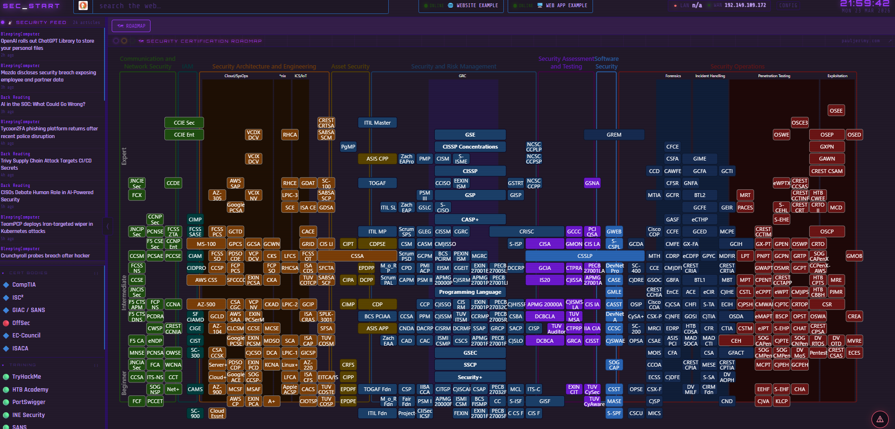

# SEC_START Setup Guide

A customizable cybersecurity start page with themes, OSINT-heavy search modes, security feeds, bookmarks, workspace tabs, and a roadmap panel.

## Recommended Browser
Vivaldi is recommended because it handles custom start pages and tab/startup behavior very cleanly.

## Quick Setup in Any Browser

1. Download or copy this folder to your machine.
2. Keep these files together in one folder:
   - startpage.html
   - config.json
   - config.html
3. Open startpage.html in your browser.
4. Set it as your start page/home page using your browser settings.
5. Optional: Pin the tab so it always opens quickly.

## Best Setup for Vivaldi 🌐

1. Open Vivaldi Settings.
2. Go to Homepage.
3. Set Homepage to the local file path for startpage.html.
4. Go to Startup.
5. Choose Open a specific page or set of pages and add the same file path.
6. Restart Vivaldi and confirm the page loads on launch.

## Customize Content and Theme 🎨

1. Open config.html.
2. Edit dropdowns, search modes, feeds, themes, bookmarks, and workspace pages.
3. Save your changes.
4. Reload startpage.html.

## Notes on Saved State

- Runtime preferences may be saved in browser local storage.
- If you changed config but do not see updates, do a hard refresh.
- If needed, clear site storage for the local file and reload.

## Troubleshooting

- Page opens but no styling: confirm all files are in the same folder.
- Theme looks wrong: reload and verify activeTheme in config.json.
- Feeds empty: verify network access and feed URLs in config.json.
